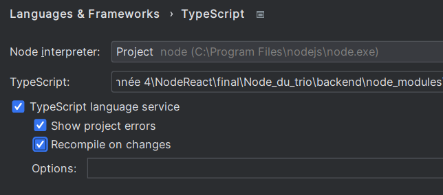

# Node_du_trio

## Installation

To make sure you have all the necessary packages installed for the project to run, please follow these steps:

- In the backend and frontend terminal, run: 'npm i'
- To finish in the backend, run 'tsc' to create the .js files

Wait a bit, now you should see .js file appear under all .ts file.

If any errors occur during these commands, make sure your Node.js is correctly installed and that you don't have any corrupted files.

## Running the Project

First, ensure that the projet will recompile all ts file on changes. To make sure the settings is on, go to settings, 
then settings sync. In language and Framework click on typescript and check the box 'Recompile on changes'.

To run the project, follow these steps:

1. In the backend terminal, run:

node app.js

2. In the frontend terminal, run:

ng serve

This will give you a link; the website is launched on this link. Click on it to access it.

## Database Setup

Make sure you have run the SQL files on the side to have a database filled with inserts.

### SQL Database Installation

To install the SQL database correctly for our project:

1. On pgAdmin using PostgreSQL, create a new user named 'learningdbUser'. Make sure this user has all privileges in their properties. In the definition tab of the user, assign a password: 'projeta4'.

2. Create a new database named 'LearningFactDb'. Ensure the owner of this database is the user we created, 'learningdbUser'.

3. Now let's go back to our user. Right-click on the user and choose the 'Reassign/drop Owned' tab. The operation must be 'Reassign.' Reassign the objects to 'pg_database_owner' in the list (it should already exist), cascade must be off, and in the 'From database' input, choose our database 'LearningFactDb'. Validate the operation.

4. Launch our database! To do so, let's first import our SQL files. Right-click on LearningFactDb and choose the Query tool to import the SQL file. Do it for each SQL file (create tables, insert, etc.). You can import the file by looking inside the computer directories or copy the SQL code into the query tool that opened. Don't forget to run the SQL scripts!

You are now good to go. 😊

