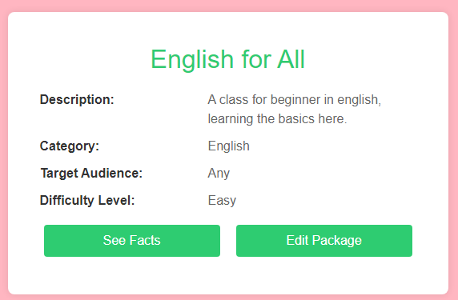
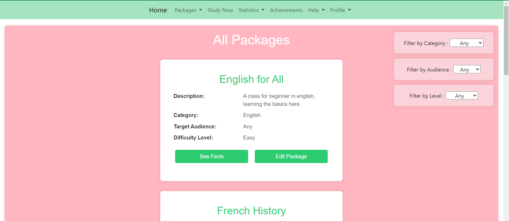
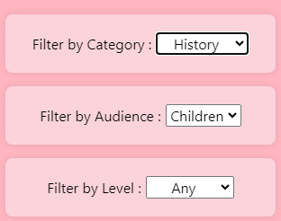
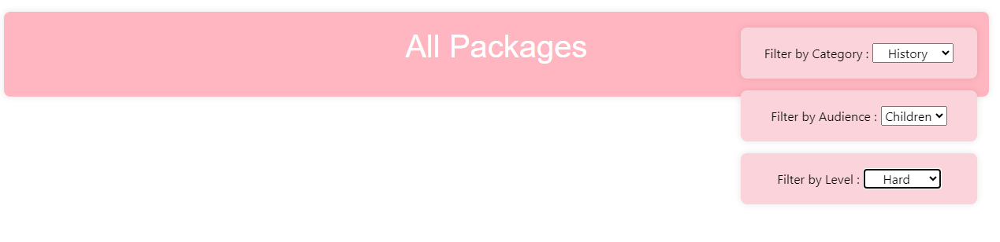
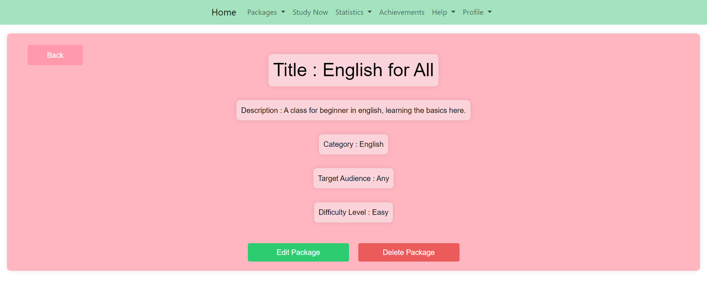

# Anki Realisation

Made by : 

Manon GARDIN : RinjieMX on Github,
Tiphaine KACHKACHI : Tiphk on Github,
Matias OTTENSEN : Mattcodman on Github

Brief description of your project.

## Table of Contents

- [Introduction](#introduction)
- [Features](#All Features)
- [Contributing](#contributing)

## Introduction

The Anki project involves managing course packages of varying difficulty levels across multiple subjects. Each package contains a multitude of questions and answers that the user must learn. Our implementation of Anki encompasses all its main functionalities, from managing a package and its facts to recording the difficulties the user encountered during reviews of the package's facts. It also includes creating charts that connect the user's overall progress.

## Home Page
![Home Page]

The Home page is the page the user sees first. It displays all most important navigations to other pages using buttons, such as the Explore-Lessons page, the StudyNow page, the Statistics page and the Help-Documentation page.

## All Features

## Feature Package

In the Packages drop-down bar, we can find two options.

The first option displays the list of all Packages in the database. All information about a package is displayed.
We can either See the facts linked to this particular package, or edit the package.

On the right of the page we can see multiples options of filter.

All the filter options can be combined. If I want to see all package made for Children in History, I can !

If no Package exist in all the filter option, the page displays nothing :

Now let's see what happens when we click on 'Edit Package' :

### Feature Fact

### Feature Study Now

### Feature Statistics

### Feature Achievements

### Feature Help

### Feature Login

## Contribution