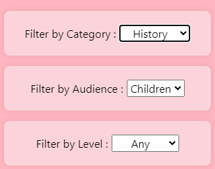
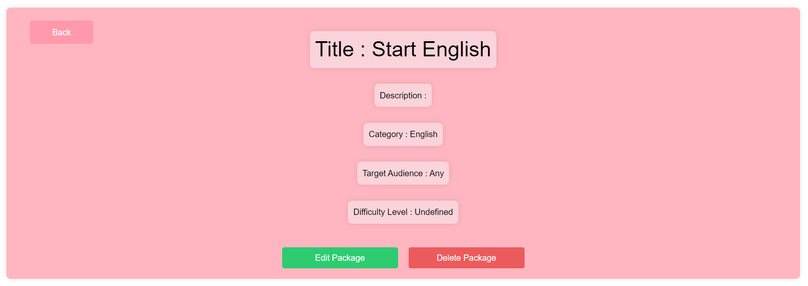
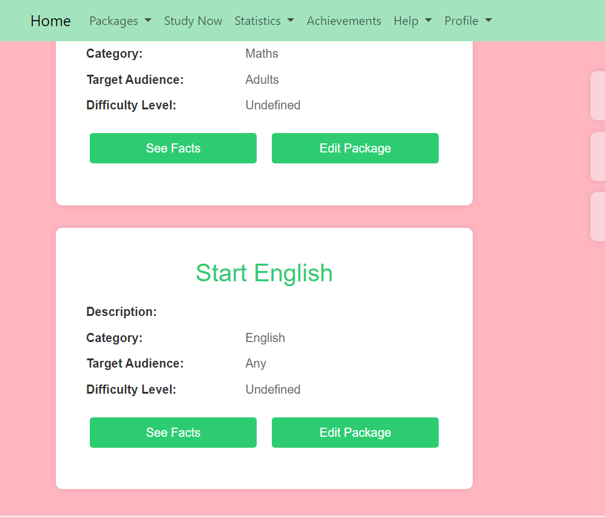

# Anki Realisation

Made by : 

Manon GARDIN : RinjieMX on Github,
Tiphaine KACHKACHI : Tiphk on Github,
Matias OTTENSEN : Mattcodman on Github

Brief description of your project.

## Table of Contents

- [Introduction](#introduction)
- [Package](#feature-package)
- [Facts](#feature-fact)
- [Study Now](#feature-study-now)
- [Contributing](#contributing)

## Introduction

The Anki project involves managing course packages of varying difficulty levels across multiple subjects. Each package contains a multitude of questions and answers that the user must learn. Our implementation of Anki encompasses all its main functionalities, from managing a package and its facts to recording the difficulties the user encountered during reviews of the package's facts. It also includes creating charts that connect the user's overall progress.

## Home Page
![Home Page]

The Home page is the page the user sees first. It displays all most important navigations to other pages using buttons, such as the Explore-Lessons page, the StudyNow page, the Statistics page and the Help-Documentation page.

## All Features

## Feature Package

In the Packages drop-down bar, we can find two options.

The first option displays the list of all Packages in the database. All information about a package is displayed.
We can either See the facts linked to this particular package, or edit the package.

On the right of the page we can see multiples options of filter.

All the filter options can be combined. If I want to see all package made for Children in History, I can !

If no Package exist in all the filter option, the page displays nothing :

Now let's see what happens when we click on 'Edit Package' :

All information about a package is displayed. Here we are offered 2 choices, either we edit the package or we can delete it.
First let's edit the package.

We can change all values. The title can't be empty. If you try to empty the title of the package, the modification won't be executed.
On the other hand, a description can be empty. let's try to modify the 'English for All' Package :

If we decided to cancel our changes, we can click on the button cancel. This will bring us back to the previous version of the Package.
In our case, we want to try if the edit works, se we will commit our changes.

Let's go back to our list of all packages to make sure the changes worked. To do it faster, we can use the back button.

We can see that the changes were indeed saved. 

Now what happens if we would like to delete a Package ?
On the 'French History' Package for example, if we hit the button Delete Package, a popup appears.

If we press ok, we get redirected to the list of all packages, and the French History package is nowhere to found. 
In another page that we will present later on, we have access to a drop-down bar that list all names of all packages found. As we can see, French History was deleted.

Now that we saw all features related the manipulation of Packages, we can go and see their associated facts. To do so, simply click on the 'See facts' button in a Package.
This will transfer us to another page that we will analyse in the next section.

### Feature Fact
here goes a photo
### Feature Study Now

### Feature Statistics

### Feature Achievements

### Feature Help

### Feature Login

## Contribution