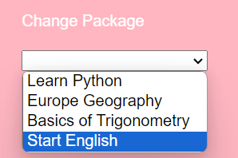

# Anki Realisation

Made by : 

Manon GARDIN : RinjieMX on Github,
Tiphaine KACHKACHI : Tiphk on Github,
Matias OTTENSEN : Mattcodman on Github

Brief description of your project.

## Table of Contents

- [Introduction](#introduction)
- [Package](#feature-package)
- [Facts](#feature-fact)
- [Study Now](#feature-study-now)
- [Statistiques](#feature-statistics)
- [Achievements](#feature-study-now)
- [Help](#feature-help)
- [Contributing](#Contribution)

## Introduction

The Anki project involves managing course packages of varying difficulty levels across multiple subjects. Each package contains a multitude of questions and answers that the user must learn. Our implementation of Anki encompasses all its main functionalities, from managing a package and its facts to recording the difficulties the user encountered during reviews of the package's facts. It also includes creating charts that connect the user's overall progress.

## Home Page

The Home page is the page the user sees first. It displays all most important navigations to other pages using buttons, such as the Explore-Lessons page, the StudyNow page, the Statistics page and the Help-Documentation page.

## All Features

## Feature Package

In the Packages drop-down bar, we can find two options.
The first option displays the list of all Packages in the database. All information about a package is displayed.
We can either See the facts linked to this particular package, or edit the package.

On the right of the page we can see multiples options of filter. All the filter options can be combined. If I want to see all package made for Children in History, I can !

If no Package exist in all the filter option, the page allows you to go add a new Package:

Now let's see what happens when we click on 'Edit Package':

All information about a package is displayed. Here we are offered 2 choices, either we edit the package or we can delete it.
First let's edit the package.

### Edit package

The display will change, and we can now change all values. The title can't be empty. If you try to empty the title of the package, the modification won't be executed.
On the other hand, a description can be empty.
If we decided to cancel our changes, we can click on the button cancel. This will bring us back to the previous version of the Package.

Let's go back to our list of all packages to make sure the changes worked. To do it faster, we can use the back button.

### Delete Package

Now what happens if we would like to delete a Package ?
On the 'French History' Package for example, if we hit the button Delete Package, a popup appears.

If we press ok, we get redirected to the list of all packages, and the French History package is nowhere to found. 
In another page that we will present later on, we have access to a drop-down bar that list all names of all packages found. As we can see, French History was deleted.

Now that we saw all features related the manipulation of Packages, we can go and see their associated facts. To do so, simply click on the 'See facts' button in a Package.
This will transfer us to another page that we will analyse in the next section.

### Add Package

In the Package section in the navbar, we also have the choice to create a new Package. 

A little * indicate us what field is required in order to create a new package. If not all * fields are completes, a small reminder pops up. 

For Category, Target Audience and Difficulty we need to choose between the options, but for Title and Description we are free to input whatever.

It's important to note that if we don't select anything for field that isn't required, the default value will be chosen for the package. 
For the description field, if nothing is written, the description will state that nothing was provided.
By default, the value for difficulty is Undefined and the value for target audience is Any.

After clicking on the Add button, a small text informs us that the package was successfully created. This message disappear after few seconds.

## Feature Fact

We were on the Explore Lessons page, and we decided to click on the 'See Facts' button. 
This opens a page that displays all facts linked to the package we clicked on appears.

We, just like on the package interface, have multiple options to choose from. If we decide to add a new fact, a new component will appear at the top in which we can directly enter the questions/responses :

To add the fact we simply click 'Commit':

We can click 'Edit' again to modify the fact. 
If we want to delete the fact we simply click on the button. A pop-Up will appear asking us if we are sure.

If we confirm the fact gets deleted. 

## Feature Study Now

Discover now the "Study Now" page, the centerpiece of our app. It is here that we will dive into the heart of the subject and review the facts that we have recorded in our packs.
The "Study Now" page will take you to an existing and not empty package. Otherwise, you will see a page informing you that no package is available, or that it is empty.

You can easily change a package by selecting it from the drop-down menu at the top left of the screen.

When studying the information, it is important to note that the facts will be presented in random order in the package. The question will be displayed, but the answer will remain hidden. To reveal it, just click on the "Reveal" button. At that time, you will also be able to indicate your level of confidence in your answer to the question by using the corresponding buttons, and you will move on to the next question.

Your choice of trust level will determine how long before the issue reappears in the revision session. The revision time will correspond to the value indicated on the button you have selected. If you prefer to proceed to the next question without answering it, simply click on "Next Question".

## Feature Statistics

here is the facts statistics chart. Is shows the amount of fact contained in every packages, 
so that the user can know the repartition

this fact displays with which difficulty the user passed the different packages.
This is a good way for the user to follow his progress

in this last chart, we can check the difficulty of every package as well as the target audience,
and the category

## Feature Achievements

If a user select 'Easy' for all facts of a Package, the Package will be listed in the Achievements page.

The Achievement shows every package that the user successfully finished once. If a fact is added to a package, and the user go to study the package in Study Now, it will be detected and won't figure anymore in the achievement page as it is no longer finished.
In the same way, after 5 days facts marked as 'easy' come back to Study Now, thus the package's fact is removed from the achievements.

## Feature Help

This section introduces the functionality of the software, showing a little bit of
every feature, so that the user understands whe he needs to do, and how to do it

In this part of our application, the user can find a lot of documentation/websites 
in order to go further in his work. It allows to get even more knowledge when every package is finished in the app,
(even if we can create new packages)

## Contribution

Concerning the statistics part, it was mostly done by Matias. It includes the importation of the Highcharts packages, the modeling of the charts, etc. His work was to gather as much data as possible in the whole application and to present it in different charts. It was necessary to use the backend app.js API to link data from different files across the frontend, import data, and store it in the charts. Tiphaine did the difficulty chart, and Manon helped Matias set the links between the chart and the app information. The most challenging part was making the data dynamic. This part took a lot of time.

In the Help part, the content was created and written by Matias (the website presentation/features explanation, as well as the documentation and the additional websites), and fully designed by Tiphaine.

Concerning the git pull/push, as not every member was used to this kind of cooperative work, the git push habit was not natural for every member of the team. So, as the tasks were attributed, sometimes, some members worked on their own without pushing or pulling in different files, in parallel. So, there were no conflicts, but not every member has the same amount of git pushes.

